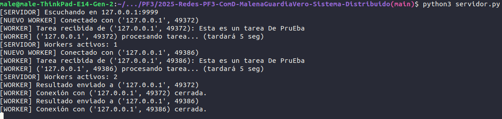

##### 2025-Redes-PF3-ComD-MalenaGuardiaVero-Sistema-Distribuido

#### Programación sobre redes 


**_Malena Guardia Vero_**
**_DNI:_** 32.344.001 
**_Comisión:_**  D 
**_IFTS 29_**  
**_Fecha:_** 31/10/2025


### Descripción

Este proyecto implementa un sistema distribuido simple utilizando sockets en Python. El servidor acepta múltiples conexiones de clientes y maneja cada una en un hilo independiente, permitiendo la concurrencia y el procesamiento paralelo de tareas enviadas por los clientes.

### Estructura de archivos

```
.
├── cliente.py
├── servidor.py
└── README.md
```

- `servidor.py`: Código fuente del servidor que acepta conexiones y procesa tareas.
- `cliente.py`: Código fuente del cliente que se conecta al servidor y envía tareas.

### Cómo probarlo
Abrir una terminal y ejecutar el servidor:
```Bash
python servidor.py
```

Veremos el mensaje: 

`[SERVIDOR] Escuchando en 127.0.0.1:9999
`

Abrimos OTRA terminal (¡dejamos la del servidor corriendo!) y ejecutamos el cliente:
```Bash
python cliente.py
```

Acá veremos:

    [CLIENTE] Conectado al servidor en 127.0.0.1:9999
    [CLIENTE] Tarea enviada: Hola mundo desde el cliente
    [CLIENTE] Resultado recibido: ESTA ES UN TAREA DE PRUEBA
    [CLIENTE] Conexión cerrada.

En la terminal del servidor veremos:

    [NUEVO WORKER] Conectado con ('127.0.0.1', 54182)
    [WORKER] Tarea recibida de ('127.0.0.1', 54182): Esta es un tarea De PruEba
    [WORKER] Resultado enviado a ('127.0.0.1', 54182)
    [WORKER] Conexión con ('127.0.0.1', 54182) cerrada.


En el servidor le agregamos un sleep para simular una tarea que tarda en procesarse, así podemos abrir varios clientes y ver cómo el servidor los atiende concurrentemente.



Ahí podemos ver que hay dos workers activos de forma concurrente.